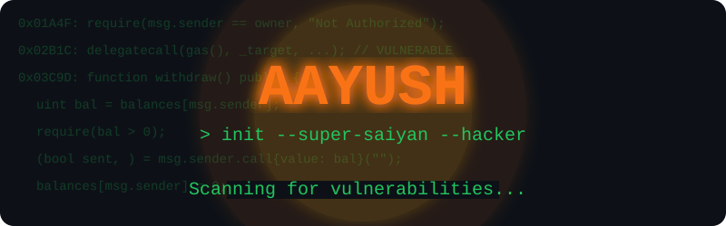
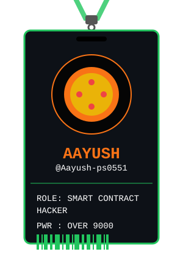

<!-- ✨ Animated Banner ✨ -->
<picture>
  
</picture>

 

<table align="center" border="0">
<tr>
<td width="38%" align="center" valign="middle">

<!-- 🪪 Swinging Lanyard ID Card -->

</td>
<td width="62%" valign="middle">

### 🐉 CYBER SECUIRTY

| 🛡️ Project | 💻 Tech | ⚡ Status |
|:---|:---:|:---:|
| **[Smart Contract Vulnerability Scanner](#)** | `Solidity` `Python` `Web3` | 🟢 Active |
| **[Network Security & Intrustion Scanner](https://github.com/Aayush-ps0551/Network-Security-System)** | `Python` `Flask` `SQLite` | 🟢 Live |

 

> 💻 *"Scanning blocks by day, going Super Saiyan by night."*

 

  

</td>
</tr>
</table>
